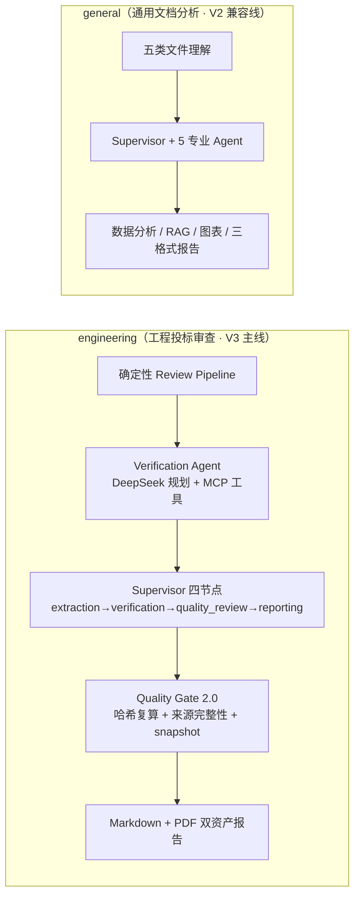
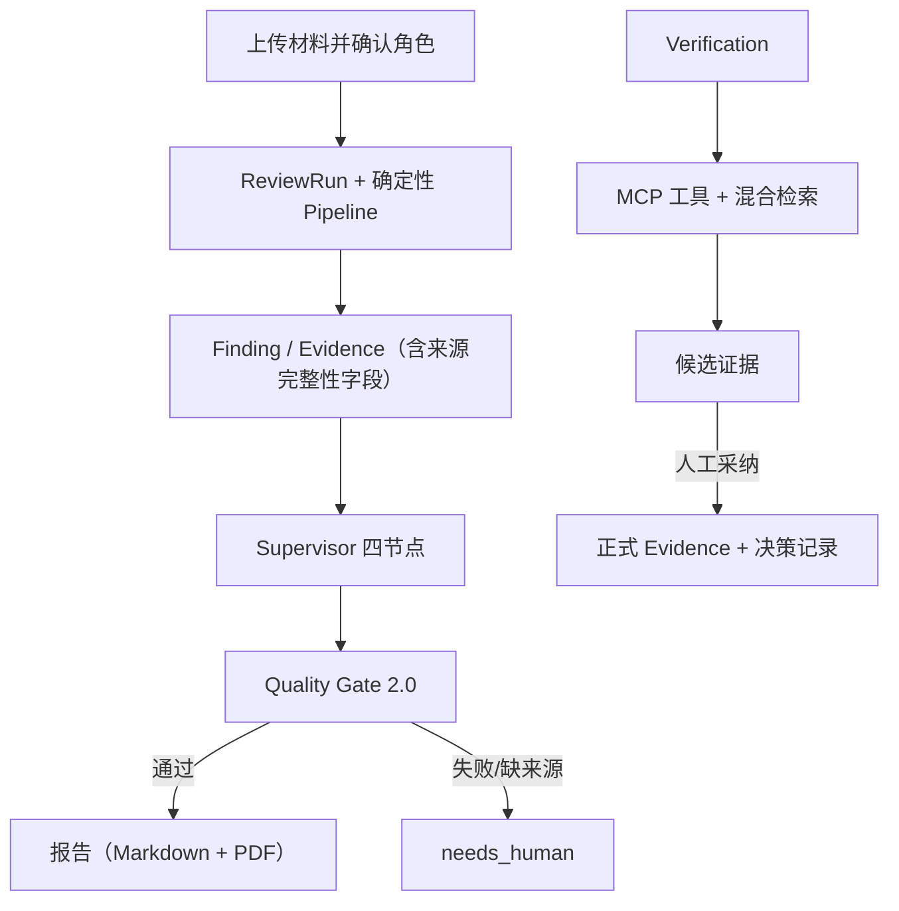

# InsightFlow Agent：多模态文档与数据分析智能体

## 项目定位

InsightFlow Agent 是一个前后端分离的 **AI 任务执行型应用**，不是普通聊天机器人。用户上传 Excel、CSV、PDF、图片、Markdown 等文件后，系统自动完成「任务判断 → 文件理解 → 工具调用 → 结果生成 → 过程可观测」的完整闭环，并提供工程投标审查（V3 主线）与通用文档分析（V2 兼容线）两条能力线。

> 当前部署状态：已完成单机 Docker 公网部署，入口为 <https://43.153.181.237/>。2026-08-11 通过真实浏览器、TLS 与匿名接口验证：首页/登录页可访问，`/api/health` 返回 `status=ok`，法律页面桌面端与 390px 视口可用。匿名接口未暴露构建 commit，因此线上实例与当前工作树的精确版本对应仍需发布标识证明。

核心关键词：**FastAPI + React + 确定性 Review Pipeline + SQLite + Agent/MCP/RAG/Supervisor/Quality Gate + Docker/CI**。

## 两条产品主线



- **工程审查**：招标要求、投标响应、人员设备清单、资质附件、项目澄清五类材料的一致性审查；确定性抽取 + 规则引擎 + LLM 核验 + 人工候选采纳边界。
- **通用分析**：V2 时代完整能力保留（认证、工作区隔离、任务队列、SSE、报告版本管理等），不再横向扩展。

## 系统架构

详细架构见 [docs/PROJECT_ARCHITECTURE.md](docs/PROJECT_ARCHITECTURE.md)。要点：

| 模块 | 说明 |
| --- | --- |
| Review Pipeline | 确定性字段抽取（PDF 标签/Excel 单元格/Markdown），六类规则引擎，Evidence 精确绑定；不调用 LLM、不含黄金答案硬编码 |
| Verification Agent | DeepSeek 规划 + 固定 MCP preflight + 混合检索工具；仅瞬时错误局部重试，成功节点不重复 |
| MCP | 官方 Streamable HTTP Server：`run_bid_consistency_checks` / `search_review_rules`；短期签名 capability token 认证，服务端归属校验 |
| Supervisor | 四节点确定性状态机，幂等复用；needs_human/failed 不伪装成功 |
| Quality Gate 2.0 | Evidence 记录哈希复算 → 来源文件哈希 → locator/chunk 核对 → input snapshot 契约 → 数字结论来源；任一失败不进报告 |
| Evidence 候选 | 检索命中只作候选；人工采纳前服务端重新校验，单事务原子提交；来源哈希全部服务端计算 |
| 检索 | BM25（稀疏）+ BGE（稠密）+ RRF 融合；Corpus 按 PDF 分页 / Excel 行区间 / Markdown 分节确定性分块 |
| 数据 | SQLite（WAL + busy timeout）+ SQLAlchemy + Alembic（当前 revision `20260812_0014`） |

### 核心链路



## 本地开发

```bash
# 后端
cd backend
python -m venv .venv && .venv/Scripts/activate   # Windows
pip install -r requirements.txt                  # 固定版本依赖
python -m uvicorn app.main:app --reload --host 127.0.0.1 --port 8000
# 独立 Worker（通用主线任务需要）：python -m app.workers.task_worker
# 健康检查：GET http://127.0.0.1:8000/api/health
# 大陆公众站公开信息（法律页/页脚数据源，无认证）：GET http://127.0.0.1:8000/api/public/site

# 前端
cd frontend
npm install
npm run dev        # http://localhost:5173
```

首次运行数据库：`python -m app.db.init_db`（Alembic 升级到 head）。本机示例 `.env` 见 `backend/.env.example`；部署占位清单见 [docs/DEPLOYMENT_V3.md](docs/DEPLOYMENT_V3.md)。

## Docker Compose

```bash
docker compose up --build          # 开发模式（backend + worker + frontend dev）
docker compose -f docker-compose.prod.yml up -d --build   # 生产形态（Nginx + backend + worker）
```

- 容器以非 root 用户（uid 10001）运行；entrypoint 幂等执行 Alembic 迁移后再启动服务；
- SQLite、uploads、reports、retrieval、backups 走 volume 持久化；API Key 只从环境变量读取；
- 不复制 `.env`/模型缓存/测试进入镜像；不自动下载大模型（BGE 见部署文档第 5 节）。

## 测试矩阵

| 层 | 内容 | 数量（实测） |
| --- | --- | --- |
| 后端 | 完整 pytest（认证/工作区/文件/任务/报告/工程审查/迁移/评测契约） | **959 collected**；最近文档化完整基线为 **791 passed**；2026-08-11 全量隔离重跑超过 300 秒未完成，不能写成 959 passed |
| 后端迁移 | Alembic upgrade/downgrade/upgrade 全链 | **16 passed** |
| 前端 | Node/Vitest 风格测试（组件/API/工具/设计系统/浏览器契约） | **116 passed**（2026-08-11 实测） |
| 前端构建 | `npm run build`（Vite 生产构建） | 通过，**92 modules transformed**（2026-08-11 实测） |
| 浏览器冒烟 | Stage 6B 真实浏览器黄金案例复核（登录/核验/发现/报告/下载/隔离/390px） | **3 passed** |
| 浏览器冒烟 | Stage 6C CI 冒烟（登录/工程页/核验页/跨用户隔离/390px） | **4 passed** |
| 公网匿名验收 | Stage 6D-2 法律页/登录页桌面与 390px | **7 passed, 1 failed**；失败项为页脚缺少“公安联网备案办理中”占位 |
| 真实评测 | Stage 6A 真实 DeepSeek + BGE + MCP 黄金案例 | 全部硬条件通过 |

CI 说明：GitHub Actions 三个 job（后端固定依赖 + Alembic + 完整 pytest；前端 npm ci + test + build；Playwright 浏览器冒烟）。CI 默认 `LLM_ENABLED=false` 不调用真实 DeepSeek、不联网下载真实 BGE（使用项目 FakeEmbedding 离线契约）、独立临时数据库与存储、并发取消 + 最小权限。

## 真实评测结果（Stage 6A）

真实 DeepSeek（planner=deepseek、无 fallback）+ 真实 BGE + 真实 Streamable HTTP MCP + 四节点 Supervisor：

| split | answerable | recall@3 | recall@5 | mrr | no-answer | FP 率 |
| --- | --- | --- | --- | --- | --- | --- |
| development | 18 | 0.8333 | 0.9167 | 0.7796 | 2 | 1.0 |
| validation | 7 | 0.6429 | 0.8571 | 0.6357 | 1 | 1.0 |
| test | 13 | 0.7308 | 0.7692 | 0.6859 | 3 | 1.0 |
| overall | 38 | 0.7632 | 0.8553 | 0.7210 | 6 | 1.0 |

- Supervisor：四节点全部 success、Quality Gate passed、Markdown+PDF 双资产、DB/磁盘 SHA 一致、Finding/Evidence/历史报告不被修改；
- 字段抽取 F1=0.8696、问题识别 F1=1.0、content_hash 复算 14/14、无证据结论率 0.0；
- MCP 局部重试：真实故障注入（`ENGINEERING_MCP_UNAVAILABLE` 首调失败 → 重试成功）`local_retry_success_rate=1.0`；
- 冻结层 evaluation split：development=20 / validation=8 / test=16，映射 SHA 固化于 `examples/engineering_review_v1/eval_results/stage6a/dataset/`。

## 浏览器证据（Playwright）

- Stage 6B：13 张真实浏览器截图（登录、材料确认、Brief、审查完成、Supervisor 四节点、报告资产、候选决策、报告版本、跨用户拒绝、发现操作、报告操作、390px 移动端）位于 `output/playwright/stage6b/`，清单见 [docs/SCREENSHOTS.md](docs/SCREENSHOTS.md)；
- Stage 6C CI 冒烟：截图/trace/video 由 CI artifacts 保留（`output/playwright/stage6c-ci-smoke-test-results/`）。

## 安全边界

- Argon2id 密码哈希、Session Cookie（HttpOnly/Secure/SameSite=Lax）+ 双 Token CSRF、工作区级数据隔离；
- 文件上传类型/大小/配额限制；不执行用户任意代码；数据分析仅通过预设工具函数；
- Evidence 来源哈希服务端计算（客户端无法伪造）；错误消息不含磁盘路径/密钥/traceback；
- MCP 固定白名单工具 + 短期签名 token + 归属二次校验；Supervisor 不修改 Finding/Evidence/历史报告；
- 容器非 root、read_only 根文件系统（生产 compose）、不复制 `.env`/密钥进镜像。

## 已知限制

- SQLite 单机写并发有限，未迁移 PostgreSQL/对象存储（升级方向见面试材料）；
- 真实 BGE 需要模型缓存（离线）或首次下载（联网）；CI 使用 Fake 契约；
- 已通过受信任的 IP 地址证书完成公网 HTTPS 部署，但尚无域名/ICP备案/公安备案；`/api/public/site` 当前仍返回 `public_launch_enabled=false`，页脚未显示公安备案办理中占位，不能描述为合规手续已完成；
- 公网匿名页面和健康检查已验收，登录后的真实上传、工程审查、MCP、报告生成和多用户并发仍需针对当前线上实例补充版本化验收；
- 历史 V2 通用主线保留兼容，不横向扩展。

## 文档入口

| 文档 | 内容 |
| --- | --- |
| [docs/PROJECT_ARCHITECTURE.md](docs/PROJECT_ARCHITECTURE.md) | V3 深度架构（pipeline/verification/MCP/supervisor/gate/候选/检索） |
| [docs/DEPLOYMENT_V3.md](docs/DEPLOYMENT_V3.md) | 低成本部署、持久化、安全配置、环境变量清单 |
| [docs/RESUME_PROJECT.md](docs/RESUME_PROJECT.md) | 简历项目描述与量化指标 |
| [docs/INTERVIEW_GUIDE.md](docs/INTERVIEW_GUIDE.md) | 面试问答与深挖点 |
| [docs/INCIDENT_POSTMORTEM.md](docs/INCIDENT_POSTMORTEM.md) | Git 对象库事故复盘（因果分层） |
| [docs/EVALUATION.md](docs/EVALUATION.md) / [docs/TESTING.md](docs/TESTING.md) | 评估与测试说明 |
| [docs/SCREENSHOTS.md](docs/SCREENSHOTS.md) | 截图清单与入口 |
| [CHANGELOG.md](CHANGELOG.md) | 版本历史（V2 全部里程碑） |

V2 历史阶段文档（认证、文件理解、任务队列、部署、验收）见 `docs/V2_*` 系列。
