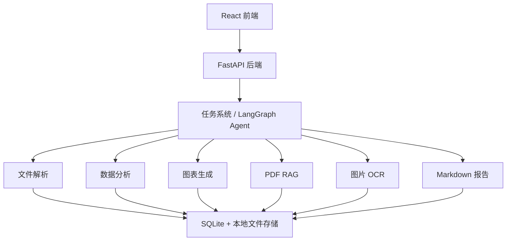

# InsightFlow Agent：多模态文档与数据分析智能体

## 项目简介

InsightFlow Agent 是一个基于 FastAPI + React + LangGraph 的多模态文档与数据分析 Agent 平台。项目支持 Excel、CSV、PDF、图片等文件上传，并通过自然语言任务完成数据分析、PDF 检索问答、图片 OCR、图表生成、Markdown 报告生成和 Agent 执行轨迹展示。

这个项目的定位不是普通聊天机器人，而是一个围绕“文件输入、任务判断、工具调用、结果生成、过程可观测”构建的任务执行型 AI 应用。

## 在线演示

- 前端：[https://insightflow-agent.vercel.app](https://insightflow-agent.vercel.app/)
- 后端：[https://insightflow-agent-spi.onrender.com](https://insightflow-agent-spi.onrender.com/)
- 健康检查：[https://insightflow-agent-spi.onrender.com/api/health](https://insightflow-agent-spi.onrender.com/api/health)
- Swagger：[https://insightflow-agent-spi.onrender.com/docs](https://insightflow-agent-spi.onrender.com/docs)

说明：公网演示版部署在 Vercel + Render 免费服务上，可能存在冷启动和临时存储限制。

## 核心功能

- 文件上传与管理：支持 `.csv`、`.xlsx`、`.pdf`、`.png`、`.jpg`、`.jpeg`。
- Excel / CSV 解析：提取字段、行列数、缺失值、预览数据等结构化信息。
- 表格数据分析：基于 Pandas 生成字段类型、数值统计、文本高频值和缺失值统计。
- 图表生成：基于 Matplotlib 生成缺失值统计图、数值统计图和分类 Top 5 图。
- PDF RAG 检索问答：对 PDF 文本分块、检索，并生成带页码和引用片段的回答。
- 图片 OCR：使用 pytesseract + Pillow 识别图片文字，并保存 OCR 结果。
- LangGraph Agent 工作流：通过确定性节点完成任务分类、计划、路由、工具执行和结果整理。
- 执行轨迹可视化：记录并展示每个 Agent 节点的输入、输出、状态、耗时和错误信息。
- LLM 可选增强：配置 API Key 后可增强任务理解、RAG 回答、最终回答和报告总结；未配置时自动降级到本地规则。
- Markdown 报告生成：基于任务、文件分析、图表、PDF 引用和 OCR 结果生成报告。
- Docker Compose 一键启动：本地可通过 `docker compose up --build` 同时启动前端和后端。

## 技术栈

- 前端：React、Vite、JavaScript、Axios。当前实现为避免新增依赖使用浏览器原生 `fetch` 封装请求层，后续可平滑替换为 Axios。
- 后端：FastAPI、Uvicorn、Pydantic。
- 数据库：SQLite、SQLAlchemy。
- 数据分析：Pandas、openpyxl。
- 图表：Matplotlib。
- PDF：PyMuPDF。
- OCR：pytesseract、Pillow、Tesseract OCR。
- Agent：LangGraph。
- 工程化：Docker、Docker Compose。

## 系统架构



## Agent 工作流

当前 Agent 使用 LangGraph 线性工作流。系统可以在配置 LLM API 后增强任务理解、回答整理和报告总结；没有 API Key 时会降级为本地规则和模板逻辑。无论是否启用 LLM，系统都不执行用户输入代码，只调用项目内预设安全工具。

```text
START
→ classify_task
→ plan_task
→ route_tools
→ execute_tool
→ write_result
→ save_result
→ END
```

- `classify_task`：根据用户输入和文件类型判断任务类型，例如数据分析、图表生成、PDF 问答、图片 OCR、报告生成等。
- `plan_task`：根据任务类型生成可读的执行计划。
- `route_tools`：选择需要调用的内部工具，例如 `data_analysis_tool`、`pdf_retrieval_tool`、`image_ocr_tool`。
- `execute_tool`：执行对应服务层能力，包括 Pandas 分析、图表生成、PDF 检索、OCR、报告生成。
- `write_result`：把工具输出整理成中文可读的 `final_answer`。
- `save_result`：保存任务状态、任务类型和最终结果，并写入执行轨迹。

## 项目目录结构

```text
NO2_agent/
  backend/
    app/
      agents/       # LangGraph Agent 节点、状态和执行入口
      api/          # FastAPI 路由
      core/         # 配置系统
      db/           # SQLAlchemy 会话和初始化脚本
      models/       # 数据库模型
      schemas/      # 请求 / 响应结构
      services/     # 文件、解析、分析、图表、RAG、OCR、报告服务
    Dockerfile
    requirements.txt
    .env.example
  frontend/
    src/
      api/          # 前端 API 请求封装
      components/   # 文件、任务、轨迹、报告组件
      pages/        # 上传、工作区、任务历史页面
    Dockerfile
    package.json
  docs/
    PRD.md
    DEMO_SCRIPT.md
    RESUME.md
    SCREENSHOTS.md
  screenshots/
    .gitkeep
  docker-compose.yml
  README.md
  AGENTS.md
```

## 本地开发启动方式

### 后端启动

```powershell
cd backend
python -m venv .venv
.venv\Scripts\activate
pip install -r requirements.txt
python -m app.db.init_db
uvicorn app.main:app --reload
```

后端默认地址：

```text
http://localhost:8000
```

### 前端启动

```powershell
cd frontend
npm install
npm run dev
```

前端默认地址：

```text
http://localhost:5173
```

## Docker Compose 启动方式

在项目根目录执行：

```powershell
cd <项目根目录>
docker compose up --build
```

访问地址：

- 前端：[http://localhost:5173](http://localhost:5173/)
- 后端：[http://localhost:8000](http://localhost:8000/)
- Swagger：[http://localhost:8000/docs](http://localhost:8000/docs)
- 健康检查：[http://localhost:8000/api/health](http://localhost:8000/api/health)

停止服务：

```powershell
docker compose down
```

Docker Compose 会把后端数据挂载到本地目录，便于重启后保留数据：

- `backend/data`：SQLite 数据库目录。
- `backend/storage/uploads`：上传文件目录。
- `backend/storage/charts`：图表图片目录。
- `backend/storage/reports`：Markdown 报告目录。

## 环境变量说明

- `backend/.env.example` 是配置模板，可以复制为 `backend/.env`。
- `backend/.env` 是真实本地配置，不应提交到 GitHub。
- `TESSERACT_CMD` 用于配置本机 Tesseract 可执行文件路径。
- `OCR_LANG` 用于配置 OCR 语言，例如 `chi_sim+eng`。

Windows 本机示例，请按实际安装位置填写：

```text
TESSERACT_CMD=<Tesseract 安装目录>/tesseract.exe
OCR_LANG=chi_sim+eng
```

Docker 演示版默认不内置 Tesseract OCR，目的是减少构建阶段对 Debian 软件源的依赖，优先保证前端和后端可以一键启动。如果容器内未配置 OCR，引擎会返回明确中文提示，不影响文件上传、表格分析、图表、PDF RAG、LangGraph 任务流和 Markdown 报告等主要功能。

## 公网部署

推荐使用前后端分离方式部署公网演示版：

- 前端：Vercel。
- 后端：Render。
- 前端通过 `VITE_API_BASE_URL` 访问 Render 后端。
- 后端通过 `CORS_ORIGINS` 允许 Vercel 前端访问。

后端 Render 启动命令示例：

```bash
python -m app.db.init_db && uvicorn app.main:app --host 0.0.0.0 --port $PORT
```

前端 Vercel 环境变量示例：

```text
VITE_API_BASE_URL=https://你的-render-后端地址.onrender.com
```

后端 Render 环境变量中需要把 `CORS_ORIGINS` 设置为真实 Vercel 前端地址，例如：

```text
CORS_ORIGINS=https://你的-vercel-前端地址.vercel.app
```

部署完成后可验证：

- 前端地址：`https://你的-vercel-前端地址.vercel.app`
- 后端健康检查：`https://你的-render-后端地址.onrender.com/api/health`
- Swagger 文档：`https://你的-render-后端地址.onrender.com/docs`

当前项目演示地址：

- 前端：[https://insightflow-agent.vercel.app](https://insightflow-agent.vercel.app/)
- 后端健康检查：[https://insightflow-agent-spi.onrender.com/api/health](https://insightflow-agent-spi.onrender.com/api/health)
- Swagger：[https://insightflow-agent-spi.onrender.com/docs](https://insightflow-agent-spi.onrender.com/docs)

免费部署版限制：

- Render 免费服务可能冷启动。
- SQLite 和本地 `storage` 只适合演示，不适合长期持久化。
- OCR 依赖部署环境是否安装 Tesseract，公网演示版可能不可用。
- 生产化建议升级为 Postgres + 对象存储，并增加认证、权限和配额控制。

完整部署步骤见 [docs/DEPLOYMENT.md](docs/DEPLOYMENT.md)。不要把真实 `LLM_API_KEY` 写入 README、代码或仓库文件。

## API 模块说明

- `/api/health`：健康检查接口。
- `/api/files`：文件上传、文件列表、文件详情、解析、分析、图表、PDF 索引、PDF 检索、图片 OCR。
- `/api/tasks`：创建自然语言任务、查看任务列表、任务详情和执行轨迹。
- `/api/reports`：查看和下载 Markdown 报告。

## 功能演示流程

适合录屏或面试展示的流程：

1. 启动项目：执行 `docker compose up --build`，打开前端和 Swagger。
2. 上传 CSV / Excel：进入上传页，选择测试表格文件并上传。
3. 解析文件：点击“解析”，展示字段、行列数、缺失值和预览数据。
4. 分析数据：点击“分析”，展示数值统计、文本高频值和缺失值统计。
5. 生成图表：点击“生成图表”，查看后端生成的图表图片。
6. 上传 PDF 并检索：上传 PDF，执行索引或在任务中提问，查看带页码的引用来源。
7. 上传图片并 OCR：上传图片，执行 OCR，查看识别文本。
8. 创建 Agent 任务：在工作区选择文件，输入自然语言任务。
9. 查看执行轨迹：观察 `classify_task`、`plan_task`、`route_tools`、`execute_tool`、`write_result`、`save_result`。
10. 生成 Markdown 报告：输入“生成分析报告”，查看报告内容并下载 `.md` 文件。

## 项目截图

> 截图将在 `screenshots/` 目录中补充，包括首页、上传页、文件解析、数据分析、图表生成、Agent 任务执行、执行轨迹、PDF RAG、图片 OCR、Markdown 报告、Docker 启动、Swagger API 文档和 GitHub README 页面。

当前仓库只保留 `screenshots/.gitkeep` 作为目录占位，没有插入不存在的图片链接。详细截图清单见 [docs/SCREENSHOTS.md](docs/SCREENSHOTS.md)。

## 项目亮点

- 不只是普通聊天机器人，而是面向文件和任务执行的多模态 Agent 应用。
- 覆盖文件解析、工具调用、LangGraph 工作流、执行轨迹、PDF RAG、图片 OCR、图表和报告生成。
- 前后端完整闭环，包含 FastAPI API、React 页面、SQLite 任务历史和本地文件存储。
- Agent 执行过程可观测，便于调试、展示和解释每一步工具调用。
- 支持 Docker Compose 一键启动，适合本地演示和面试讲解。
- 已整理 Vercel + Render 免费公网部署方案，适合快速给面试官打开演示。
- 适合 AI 应用开发、AI Agent 开发、后端工程和数据分析工具方向展示。

## 适合岗位

- AI 应用开发实习。
- AI Agent 应用开发实习。
- Python 后端开发实习。
- RAG 应用开发实习。
- 全栈 AI 应用开发实习。

## 当前限制

- 当前是单用户演示版，不是生产级 SaaS。
- RAG 使用关键词和轻量 TF-IDF 检索，不是生产级向量数据库方案。
- OCR 依赖本机或容器环境中的 Tesseract 配置。
- Render 免费部署存在冷启动和临时存储限制。
- 暂不支持用户登录。
- 暂不支持生产级权限管理。
- 暂不支持复杂多轮记忆。
- 暂不支持云端对象存储和分布式任务队列。

## 后续规划

- MCP 工具封装。
- 向量数据库增强，例如 Chroma、FAISS 或其他检索后端。
- 多文件跨文档问答增强。
- DOCX / PDF 报告导出。
- 用户登录和权限管理。
- 生产级云端部署，例如 Postgres、对象存储和后台任务队列。
- 测试、评估和任务回归体系。
