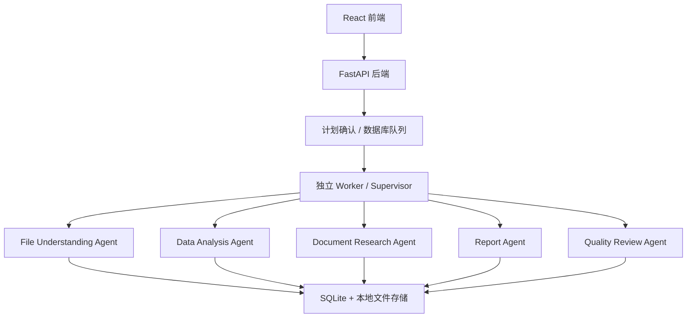

# InsightFlow Agent：多模态文档与数据分析智能体

## 项目简介

InsightFlow Agent 是一个基于 FastAPI + React + LangGraph 的多模态文档与数据分析 Agent 平台。项目支持 Excel、CSV、PDF、图片和 Markdown 文件上传，并通过统一文件理解、自然语言任务、PDF 检索问答、图片 OCR、图表生成、Markdown 报告生成和 Agent 执行轨迹展示完成分析工作。

这个项目的定位不是普通聊天机器人，而是一个围绕“文件输入、任务判断、工具调用、结果生成、过程可观测”构建的任务执行型 AI 应用。

## V2-06 当前状态

V2-06 已在 V2-02 至 V2-05 的真实业务能力上完成全站前端重设计：统一设计 Token、浅色/深色/跟随系统主题、公共组件、响应式工作台布局、工作区子路由、批量上传、文件理解、计划确认、SSE 执行、报告阅读、使用量与管理员治理体验。

本阶段没有增加后台业务接口，没有改变 Cookie Session、CSRF、工作区隔离、队列和下载规则，也没有引入新的前端依赖。前端仍以服务端状态为真相来源，默认使用同域相对 `/api/v2`。

详细说明：

- [V2-06 UI/UX 系统](docs/V2_06_UI_UX_SYSTEM.md)
- [V2-06 手动验收](docs/V2_06_MANUAL_ACCEPTANCE.md)
- [V2-05 报告与治理](docs/V2_05_REPORTS_GOVERNANCE_EVALUATION.md)
- [V2-05 手动验收](docs/V2_05_MANUAL_ACCEPTANCE.md)
- [V2-05 评估指南](docs/V2_05_EVALUATION_GUIDE.md)
- [V2-05 备份恢复](docs/V2_05_BACKUP_AND_RECOVERY.md)

真实数据库升级前必须停写并备份，再手工执行：

```powershell
cd D:\spir\NO2_agent\backend
.\.venv\Scripts\alembic.exe current
.\.venv\Scripts\alembic.exe heads
.\.venv\Scripts\alembic.exe upgrade head
```

V2-04 当前状态说明保留如下，作为兼容基础。

## V2-04 兼容基础

当前代码已在 V2-03 文件理解基础上完成 V2-04 可靠任务执行层：自然语言任务草稿、最多两轮主动追问、版本化计划、可视化修改与确认、SQLite 持久化队列、独立单 Worker、租约与心跳、SSE/轮询恢复、协作式取消、受限局部重试，以及 Supervisor + File Understanding、Data Analysis、Document Research、Report、Quality Review 五个专业 Agent。计划确认前不会执行正式分析工具。

旧 `/api/files`、`/api/tasks`、`/api/reports` 仅为本地兼容保留，由 `ENABLE_LEGACY_V1_API` 控制。旧接口没有完整多用户隔离，正式公网环境必须设置为 `false`。

V2-03 的文件理解接口本身仍为同步调用；V2-04 新任务执行已进入独立 Worker。当前不支持任意节点暂停后原地恢复、Redis/Celery、PostgreSQL、对象存储或正式国内生产部署。Markdown/DOCX/PDF 版本化导出已在 V2-05 实现。

## 在线演示

- 前端：[https://insightflow-agent.vercel.app](https://insightflow-agent.vercel.app/)
- 后端：[https://insightflow-agent-spi.onrender.com](https://insightflow-agent-spi.onrender.com/)
- 健康检查：[https://insightflow-agent-spi.onrender.com/api/health](https://insightflow-agent-spi.onrender.com/api/health)
- Swagger：[https://insightflow-agent-spi.onrender.com/docs](https://insightflow-agent-spi.onrender.com/docs)

说明：该地址是旧版演示，不代表 V2 的最终生产部署方案。V2 正式环境应采用同域名前端和 `/api` 反向代理，并使用持久数据库与持久文件存储。

## 核心功能

- 安全文件上传：支持 `.csv`、`.xlsx`、`.pdf`、`.png`、`.jpg`、`.jpeg`、`.webp`、`.md`、`.markdown`，并校验扩展名、MIME、内容特征、大小和配额。
- 统一文件理解：为表格、PDF、图片和 Markdown 生成版本化 Profile，包括摘要、结构、统计、质量、角色、标签、解析器和降级信息。
- 文件关系：基于字段、标题、文件名、文档和 OCR 特征生成可解释候选，必须由用户确认后才视为事实。
- Workspace Context：按选中文件生成脱敏、裁剪、版本化的后续 Agent 输入。
- Excel / CSV 解析：覆盖所有工作表，提取字段、行列数、类型、样本、缺失值、重复行、数值统计、日期范围和标识列候选。
- 表格数据分析：基于 Pandas 生成字段类型、数值统计、文本高频值和缺失值统计。
- 图表生成：基于 Matplotlib 生成缺失值统计图、数值统计图和分类 Top 5 图。
- PDF RAG 检索问答：对 PDF 文本分块、检索，并生成带页码和引用片段的回答。
- 图片 OCR：使用 pytesseract + Pillow 识别图片文字，并保存 OCR 结果。
- 可靠任务执行：计划确认后进入数据库队列，由独立 Worker 通过租约认领并逐步骤持久化。
- 多 Agent：Supervisor 调度五个职责明确的专业 Agent；解析、OCR、Pandas、图表、检索和报告写入仍是注册工具。
- 实时进度：SSE 支持断线事件恢复，前端失败后自动降级增量轮询。
- 执行轨迹可视化：记录并展示每个 Agent 节点的输入、输出、状态、耗时和错误信息。
- LLM 可选增强：配置 API Key 后可增强任务理解、RAG 回答、最终回答和报告总结；未配置时自动降级到本地规则。
- Markdown 报告生成：基于任务、文件分析、图表、PDF 引用和 OCR 结果生成报告。
- Docker Compose 一键启动：本地可通过 `docker compose up --build` 同时启动前端和后端。

## 技术栈

- 前端：React、React Router、Vite、浏览器原生 `fetch`。
- 后端：FastAPI、Uvicorn、Pydantic。
- 数据库：SQLite、SQLAlchemy。
- 数据分析：Pandas、openpyxl。
- 图表：Matplotlib。
- PDF：PyMuPDF。
- OCR：pytesseract、Pillow、Tesseract OCR。
- Agent：LangGraph。
- 工程化：Docker、Docker Compose。

## 系统架构



## V2 Agent 工作流

```text
任务草稿 → 主动追问 → Supervisor 计划草稿 → 用户确认
→ 持久化队列 → Worker 租约认领 → 五个专业 Agent
→ Quality Review → 最多一次局部重试 → Markdown 报告
```

旧 V1 LangGraph 仅在 `ENABLE_LEGACY_V1_API=true` 时保留兼容。V2 Tool Registry 不允许任意 Python、Shell、SQL、URL、动态 import 或未注册工具。

## 项目目录结构

```text
NO2_agent/
  backend/
    app/
      agents/       # LangGraph Agent 节点、状态和执行入口
      api/          # FastAPI 路由
      core/         # 配置系统
      db/           # SQLAlchemy 会话和初始化脚本
      models/       # 数据库模型
      schemas/      # 请求 / 响应结构
      services/     # 文件、解析、分析、图表、RAG、OCR、报告服务
    Dockerfile
    requirements.txt
    .env.example
  frontend/
    src/
      api/          # 前端 API 请求封装
      components/   # 公共控件、布局、文件、任务、报告和管理组件
      context/      # 认证、主题和全局反馈
      pages/        # 认证、工作区、使用量和管理页面
      styles/       # 设计 Token
      utils/        # 状态、错误、SSE 和报告等纯逻辑
    Dockerfile
    package.json
  docs/
    PRD.md
    DEMO_SCRIPT.md
    DEPLOYMENT.md
    EVALUATION.md
    FINAL_CHECKLIST.md
    INTERVIEW_QA.md
    MCP_PLAN.md
    PROJECT_REVIEW.md
    RESUME.md
    SCREENSHOTS.md
    TESTING.md
  screenshots/
    .gitkeep
  docker-compose.yml
  README.md
  AGENTS.md
```

## 本地开发启动方式

### 后端启动

```powershell
cd backend
python -m venv .venv
.venv\Scripts\activate
pip install -r requirements.txt
alembic upgrade head
python -m app.cli.create_admin
python -m uvicorn app.main:app --reload --host 127.0.0.1 --port 8000
```

### Worker 启动

另开一个终端：

```powershell
cd backend
.venv\Scripts\activate
python -m app.workers.task_worker
```

后端默认地址：

```text
http://localhost:8000
```

### 前端启动

```powershell
cd frontend
npm install
npm run dev
```

前端默认地址：

```text
http://localhost:5173
```

## Docker Compose 启动方式

在项目根目录执行：

```powershell
cd <项目根目录>
docker compose up --build
```

访问地址：

- 前端：[http://localhost:5173](http://localhost:5173/)
- 后端：[http://localhost:8000](http://localhost:8000/)
- Swagger：[http://localhost:8000/docs](http://localhost:8000/docs)
- 健康检查：[http://localhost:8000/api/health](http://localhost:8000/api/health)

停止服务：

```powershell
docker compose down
```

Docker Compose 会把后端数据挂载到本地目录，便于重启后保留数据：

- `backend/data`：SQLite 数据库目录。
- `backend/storage/uploads`：上传文件目录。
- `backend/storage/charts`：图表图片目录。
- `backend/storage/reports`：Markdown 报告目录。

## 环境变量说明

- `backend/.env.example` 是配置模板，可以复制为 `backend/.env`。
- `backend/.env` 是真实本地配置，不应提交到 GitHub。
- `TESSERACT_CMD` 用于配置本机 Tesseract 可执行文件路径。
- `OCR_LANG` 用于配置 OCR 语言，例如 `chi_sim+eng`。
- `AUTH_SECRET_KEY` 必须使用至少 32 字符的独立高熵密钥；生产环境缺失时应用会拒绝启动。
- `AUTH_COOKIE_SECURE` 在本地 HTTP 可为 `false`，生产 HTTPS 必须为 `true`。
- `ENABLE_LEGACY_V1_API` 本地兼容阶段可为 `true`，正式公网必须为 `false`。
- `UPLOAD_MAX_FILE_SIZE_BYTES`、`UPLOAD_MAX_BATCH_FILES`、`WORKSPACE_MAX_FILES`、`USER_STORAGE_QUOTA_BYTES` 控制上传安全和配额。
- `RELATION_MIN_CONFIDENCE`、`RELATION_HIGH_CONFIDENCE`、`RELATION_MAX_PAIRS` 控制关系候选。
- `WORKSPACE_CONTEXT_MAX_FILES`、`WORKSPACE_CONTEXT_MAX_CHARS` 控制上下文裁剪。
- `WORKER_POLL_INTERVAL_SECONDS`、`WORKER_LEASE_SECONDS`、`WORKER_HEARTBEAT_SECONDS` 控制单 Worker 轮询、租约和心跳。
- `TASK_MAX_RETRIES`、`AGENT_MAX_REPLAN_COUNT`、`AGENT_MAX_REVIEW_RETRIES`、`TASK_MAX_CLARIFICATION_ROUNDS` 控制重试和循环上限。

V2-03 所有默认值和完整调整方式见 [docs/V2_03_FILE_UNDERSTANDING.md](docs/V2_03_FILE_UNDERSTANDING.md)；真实密钥只应写入部署环境或未提交的 `backend/.env`。

Windows 本机示例，请按实际安装位置填写：

```text
TESSERACT_CMD=<Tesseract 安装目录>/tesseract.exe
OCR_LANG=chi_sim+eng
```

Docker 演示版默认不内置 Tesseract OCR，目的是减少构建阶段对 Debian 软件源的依赖，优先保证前端和后端可以一键启动。如果容器内未配置 OCR，引擎会返回明确中文提示，不影响文件上传、表格分析、图表、PDF RAG、LangGraph 任务流和 Markdown 报告等主要功能。

## 测试命令

后端轻量测试：

```powershell
cd backend
pytest
```

前端纯逻辑测试与构建：

```powershell
cd frontend
npm test
npm run build
```

完整测试说明见 [docs/TESTING.md](docs/TESTING.md)，项目评估方法见 [docs/EVALUATION.md](docs/EVALUATION.md)，最终发布检查清单见 [docs/FINAL_CHECKLIST.md](docs/FINAL_CHECKLIST.md)。

## 国内同域部署入口

V2 的低并发正式部署目标是同域名提供前端，反向代理将 `/api` 转发到 FastAPI。前端默认使用相对 `/api/v2`；`VITE_API_BASE_URL` 只作为兼容覆盖项。当前 Vercel + Render 组合仅用于旧版演示，不作为 V2 最终生产目标。

同域反向代理需要：

- 前端静态资源和 API 使用同一站点；
- `/api` 转发到 FastAPI，SSE 路径关闭代理缓冲并配置足够读超时；
- Cookie、CSRF、可信代理头和 HTTPS 安全选项按同域配置；
- 报告下载保留 `Content-Disposition` 和鉴权 Cookie；
- 不在业务组件写死 localhost、Vercel、Render 或外部 CDN。

当前项目演示地址：

- 前端：[https://insightflow-agent.vercel.app](https://insightflow-agent.vercel.app/)
- 后端健康检查：[https://insightflow-agent-spi.onrender.com/api/health](https://insightflow-agent-spi.onrender.com/api/health)
- Swagger：[https://insightflow-agent-spi.onrender.com/docs](https://insightflow-agent-spi.onrender.com/docs)

免费部署版限制：

- Render 免费服务可能冷启动。
- SQLite 和本地 `storage` 只适合演示，不适合长期持久化。
- OCR 依赖部署环境是否安装 Tesseract，公网演示版可能不可用。
- 生产化建议升级为 Postgres + 对象存储，并增加认证、权限和配额控制。

完整部署步骤见 [docs/DEPLOYMENT.md](docs/DEPLOYMENT.md)。不要把真实 `LLM_API_KEY` 写入 README、代码或仓库文件。

## API 模块说明

- `/api/health`：健康检查接口。
- `/api/v2/auth`、`/api/v2/admin`、`/api/v2/workspaces`：认证、最小管理员后台和用户工作区。
- `/api/v2/workspaces/{workspace_id}/files`：工作区文件列表、单文件和批量上传。
- `/api/v2/workspaces/{workspace_id}/files/*/understand|profile`：单个/批量文件理解、Profile 查询和角色标签确认。
- `/api/v2/workspaces/{workspace_id}/file-relations`：关系发现、筛选、确认、拒绝和修正。
- `/api/v2/workspaces/{workspace_id}/context-preview`：生成脱敏的 Workspace Context 预览。
- `/api/v2/workspaces/{workspace_id}/tasks/drafts`：创建 V2 任务草稿并触发追问或计划。
- `/api/v2/workspaces/{workspace_id}/tasks/{task_id}/plans/*`：版本化修改、重新生成和确认计划。
- `/api/v2/workspaces/{workspace_id}/tasks/{task_id}/events/stream`：SSE 实时任务事件。
- `/api/v2/workspaces/{workspace_id}/tasks/{task_id}/cancel|retry`：取消和受限重试。
- `/api/files`：文件上传、文件列表、文件详情、解析、分析、图表、PDF 索引、PDF 检索、图片 OCR。
- `/api/tasks`：创建自然语言任务、查看任务列表、任务详情和执行轨迹。
- `/api/reports`：查看和下载 Markdown 报告。

## 功能演示流程

适合录屏或面试展示的流程：

1. 启动项目：执行 `docker compose up --build`，打开前端和 Swagger。
2. 管理员创建邀请码，注册普通用户并创建工作区。
3. 批量上传 CSV、XLSX、PDF、图片和 Markdown，检查逐文件验证状态。
4. 批量理解文件，查看摘要、结构、质量、建议角色、标签、解析器和降级信息。
5. 确认或修改角色和标签，重新理解后确认值仍被保留。
6. 发现文件关系，确认、拒绝并修正关系类型和备注。
7. 选择文件并查看 Workspace Context，确认仅包含安全元数据、角色、关系和质量问题。
8. 创建任务草稿，回答追问，修改并确认计划。
9. 启动 Worker，通过 SSE 查看五个 Agent 的步骤、工具摘要和进度。
10. 验证取消、失败步骤重试、Quality Review 和 Markdown 报告。
11. 使用第二个用户验证任务、事件、计划、报告和图表隔离。

完整步骤见 [docs/V2_04_MANUAL_ACCEPTANCE.md](docs/V2_04_MANUAL_ACCEPTANCE.md)。

## 项目截图

> 截图将在 `screenshots/` 目录中补充，包括首页、上传页、文件解析、数据分析、图表生成、Agent 任务执行、执行轨迹、PDF RAG、图片 OCR、Markdown 报告、Docker 启动、Swagger API 文档和 GitHub README 页面。

当前仓库只保留 `screenshots/.gitkeep` 作为目录占位，没有插入不存在的图片链接。详细截图清单见 [docs/SCREENSHOTS.md](docs/SCREENSHOTS.md)。

## 项目亮点

- 不只是普通聊天机器人，而是面向文件和任务执行的多模态 Agent 应用。
- 覆盖文件解析、工具调用、LangGraph 工作流、执行轨迹、PDF RAG、图片 OCR、图表和报告生成。
- 前后端完整闭环，包含 FastAPI API、React 页面、SQLite 任务历史和本地文件存储。
- Agent 执行过程可观测，便于调试、展示和解释每一步工具调用。
- 支持 Docker Compose 一键启动，适合本地演示和面试讲解。
- 已整理 Vercel + Render 免费公网部署方案，适合快速给面试官打开演示。
- 适合 AI 应用开发、AI Agent 开发、后端工程和数据分析工具方向展示。

## 适合岗位

- AI 应用开发实习。
- AI Agent 应用开发实习。
- Python 后端开发实习。
- RAG 应用开发实习。
- 全栈 AI 应用开发实习。

## 当前限制

- 当前具备低并发多用户认证与工作区隔离，但仍不是生产级 SaaS。
- RAG 使用关键词和轻量 TF-IDF 检索，不是生产级向量数据库方案。
- OCR 依赖本机或容器环境中的 Tesseract 配置。
- 扫描 PDF 目前只标记需要 OCR，不执行 PDF 页面 OCR。
- Render 免费部署存在冷启动和临时存储限制。
- 暂不支持复杂多轮记忆。
- 文件理解接口仍为同步调用；V2 任务已异步执行，但当前仅支持单机单 Worker。
- 不支持任意节点暂停后原地恢复；进程异常依靠租约过期后重新认领和已完成步骤复用。
- 暂不支持云端对象存储及生产级备份恢复。

## 后续规划

- V2-05：补齐报告/资产独立版本表、任务配额、运行监控、评估集和生产安全门禁。
- 后续迁移对象存储、PostgreSQL 和专业队列后端。
- 向量检索、多文件跨文档问答和生产级备份恢复。
- DOCX / PDF 报告导出与更完整的测试、评估和任务回归体系。
