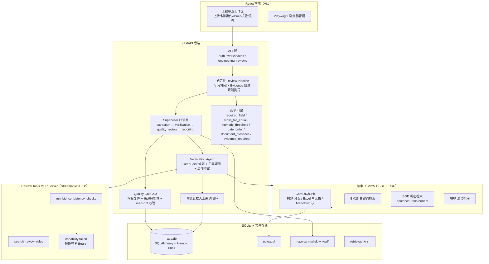

# InsightFlow Agent 系统架构（V3）

## 1. 两条产品主线

| 主线 | 定位 | 状态 |
| --- | --- | --- |
| **engineering（工程投标审查）** | 招标要求 ↔ 投标响应 ↔ 人员设备清单 ↔ 资质附件的自动化一致性审查，确定性管道 + LLM 核验 + 四节点 Supervisor + 质量门 + 报告 | 当前主开发线（V3） |
| **general（通用文档分析，旧版 V2）** | 多模态文件理解、数据分析、RAG 问答、报告导出，Supervisor + 五个专业 Agent | 保留兼容，不再横向扩展 |

## 2. 系统架构图

## 3. Review pipeline（确定性字段抽取）

`engineering_review_pipeline_service.run_engineering_review` 不调用 LLM、不读取 ground_truth.json、不含黄金答案硬编码：

1. 从 ReviewRun 快照恢复规则包并校验 `rule_pack_hash`；
2. 校验五个必需角色（招标要求/投标响应/人员设备清单/资质附件/项目澄清）的文件与 Profile；
3. 按角色执行确定性抽取（PDF 标签/正则、Excel 单元格、Markdown 存在性）；
4. 创建 Evidence 前按真实文件校验 locator（PDF page、Excel sheet+cell、text chunk 0-based 编号）；
5. 每条 Evidence 携带来源完整性字段：`provenance_type=field_locator`、`source_file_hash`（服务端按安全解析后的当前文件字节计算）；
6. 抽取完成后自动持久化 `input_snapshot_json` + `input_snapshot_hash`（规范 JSON、sort_keys）；
7. 执行六类确定性规则，生成 Finding 并精确绑定 Evidence。

## 4. Evidence 与 CorpusChunk 哈希语义（重要）

- `Evidence.content_hash`：**证据记录规范哈希** = `{file_id, locator_type, page_number, sheet_name, cell_range, chunk_id, quote}` 的 JSON sort_keys SHA-256。用于证明证据记录本身未被篡改。
- `CorpusChunk.content_hash`：**来源文本块哈希** = `sha256(chunk.text)`。用于识别语料内容变化。
- 两者语义不同，**不得直接比较**。Quality Gate 先复算记录哈希，再独立核对来源：
  - `source_file_hash`：证据创建时来源文件字节 SHA-256（当前文件变化 → `EVIDENCE_STALE`）；
  - `field_locator`：按真实 locator 校验（page/sheet+cell/chunk 编号存在）；
  - `corpus_chunk`（检索候选采纳）：重新定位 chunk 并核对 `source_chunk_hash`；
  - 历史 Evidence 缺来源字段 → 独立稳定错误 `EVIDENCE_PROVENANCE_MISSING` → needs_human，禁止静默放行。
- text_chunk 编号统一 **0-based**（与 Corpus `text_chunk_index` 一致，`chunk_id=0` 合法）。

## 5. Verification Agent 与 MCP

- DeepSeek 规划（`planner_type=deepseek`，fallback 时 `deterministic_fallback`）→ 固定 MCP preflight（`run_bid_consistency_checks` + `search_review_rules`）→ 检索工具调用 → 候选证据收集。
- MCP 使用官方 Streamable HTTP 传输 + **capability token**（短期 HMAC 签名 Bearer，subject=真实 user_id）：服务端不信任客户端参数中的 owner，`_resolve_owned_run` 以认证 subject 校验归属。
- 瞬时错误（`ENGINEERING_MCP_UNAVAILABLE`/`ENGINEERING_MCP_TIMEOUT`）只重试失败工具一次，成功节点不重复；`attempt_number`/`retry_of_id`/`error_code` 完整审计。实测局部重试成功率 1.0。
- 检索工具输出带 `candidate_only` + `requires_human_confirmation` 边界标记，仅作为候选。

## 6. Supervisor 四节点与 Quality Gate

确定性状态机：`extraction → verification → quality_review → reporting`。Supervisor 只根据结构化状态、错误码和质量门结果决策，不新增第二次 LLM 规划；相同稳定输入幂等复用（needs_human/failed 不伪装成功复用）。

Quality Gate 2.0 检查链：规则快照匹配 → Evidence 归属 → 记录哈希复算 → 来源完整性（文件哈希 + locator/chunk）→ input snapshot 契约（存在、SHA-256 一致、必需字段在场）→ 数字结论来源（`engine:<rule_id>`）。任一失败 → `needs_human`，不生成报告。

## 7. Evidence 候选采纳边界

- 只从成功检索 ToolCall 组装候选；接受前服务端重新校验（corpus/index SHA、chunk_id 重定位、quote 重生成）；
- 接受 = Evidence + Finding 绑定 + 决策单事务原子提交；拒绝只写决策；
- 不自动确认/驳回/修改 Finding，不生成新报告；
- 来源哈希全部服务端计算，客户端无法传入。

## 8. 检索：BM25 + BGE + RRF

- Corpus 构建：PDF 逐页滑动窗口、Excel 按工作表+行区间、Markdown 按标题分节，`chunk_id = W{ws}F{file}C{index}`；
- 混合检索：BM25 稀疏 + BGE（sentence-transformers）稠密，RRF 融合排序；
- 索引 Manifest 记录 corpus/index SHA，候选校验依赖这些 SHA 防止静默使用旧索引；
- 真实评测（Stage 6A，真实 BGE）：development recall@3=0.8333 / validation 0.6429 / test 0.7308 / overall 0.7632。

## 9. 数据与部署

- SQLite（WAL、busy timeout）+ SQLAlchemy + Alembic（当前 revision `20260812_0014`）；
- uploads/、reports/、retrieval/ 为持久化目录，容器以非 root 用户运行，启动 entrypoint 幂等执行迁移；
- 前端 React（Vite 构建产物由 Nginx 托管，SPA fallback + SSE 反代 + 安全头）。
