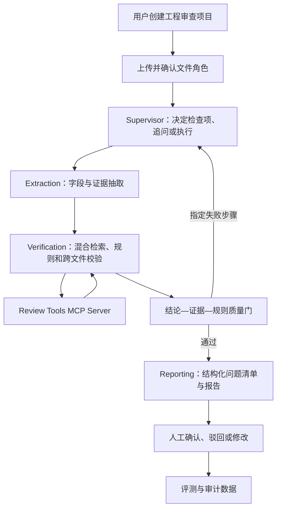

# InsightFlow V3：工程投标资料证据化审查 Agent 改造路线

更新时间：2026-08-06  
状态：规划基线，等待分阶段实施  
目标岗位：AI 应用开发、Agent 开发、大模型应用开发实习或校招

## 1. 最终目标

把当前通用多模态分析平台收敛为：

> 面向工程检测服务投标资料的证据化辅助审查 Agent。系统对招标要求、投标响应、人员设备表和资质附件执行结构化抽取、规则检索、跨文件一致性校验、风险提示和证据定位，最终结论必须由专业人员确认。

产品不得声称自动判定投标文件或工程报告“合规”。对外统一使用“辅助审查、风险提示、证据定位、人工复核”。

## 2. 已确认的产品决策

### 2.1 产品区域

- `engineering`：工程审查主线，默认首页，后续开发资源全部投入这里。
- `general`：承接现有通用文档分析能力，只修严重缺陷，不继续横向扩展。
- 使用量、管理后台：账户与系统工具，不作为业务产品主线。

现有工作区迁移为 `general`；新建工程项目使用 `engineering`。认证、上传、队列、Worker、SSE、报告存储和权限隔离继续复用。

### 2.2 界面要求

1. 将 `InsightFlow Agent` 和“多模态分析工作台”等通用表达改为更聚焦的工程审查产品表达。实施阶段暂用“InsightFlow 工程投标审查 Agent”，无需为了品牌名阻塞开发。
2. 左侧导航重组为工程审查、通用分析、使用量、管理后台。工程审查为默认入口；通用分析降低视觉权重并标注“旧版”。
3. 修复创建工作区时名称和描述只能逐字输入的问题。当前高概率根因是 `Dialog` 的聚焦副作用依赖每次渲染都会变化的内联 `onClose` 回调；实施时仍必须先复现再修复。

### 2.3 首个演示场景

第一版只做“工程检测服务投标资料一致性辅助审查”，不同时扩展到所有工程检测报告。

输入材料：

- 合成招标要求 PDF；
- 合成投标响应 PDF；
- 人员与设备清单 Excel；
- 合成资质附件 PDF；
- 项目澄清文件 Markdown。

输出问题示例：

```text
问题：项目负责人证书编号在投标响应与人员清单中不一致
风险等级：高
结论：两个文件记录了不同证书编号
规则依据：招标要求 R-PERSON-003
证据：E-BID-012、E-XLSX-027
处理建议：人工核对原始证书与投标响应
复核状态：待复核
```

所有样例必须显著标注“合成演示数据，不作为真实工程、招投标或法律判断依据”。

## 3. 项目必须证明的三项能力

### 3.1 带指标的检索对比

至少对比：

- 当前 TF-IDF 基线；
- BM25 关键词检索；
- Embedding 语义检索；
- BM25 + Embedding 混合检索；
- 可选 reranker，仅在指标收益能够覆盖延迟成本时保留。

记录 Recall@3、Recall@5、MRR、引用正确率和 P95 延迟。不得把 TF-IDF 标记为 `vector`。

### 3.2 可解释的局部重试

当 MCP 工具暂时不可用、结构化抽取校验失败或 Quality Review 发现证据绑定错误时，只重试失败步骤。已成功的解析、抽取和检索结果不得无条件重跑。

### 3.3 可复现的量化结果

真实运行评测必须从本次执行结果计算，不能用期望值回填。85 条 V2 deterministic 数据保留为旧版回归，不再作为 V3 AI 效果证明。

## 4. V3 目标架构



Supervisor 只负责：

- 选择需要的检查和顺序；
- 判断信息是否充足；
- 触发追问；
- 根据结构化失败原因局部重试；
- 达到循环上限后停止并请求人工处理。

核心执行节点只保留：

- Extraction；
- Verification；
- Reporting。

Quality Review 是确定性质量门，不包装成第 4 个“专业 Agent”。

## 5. 核心数据结构

### 5.1 Workspace

在现有工作区上增加：

```text
workspace_type: engineering | general
review_template_key: nullable
```

迁移规则：所有已有数据为 `general`，工程入口新建的数据为 `engineering`。

### 5.2 文件角色

首版固定为：

```text
tender_requirement
bid_response
personnel_equipment_data
qualification_attachment
clarification_document
supplementary_attachment
```

系统可以建议角色，但必须允许人工确认和修正。

### 5.3 关系类型

```text
constrains
responds_to
data_source_of
evidence_for
supersedes
```

关系建议不能自动成为事实，继续复用现有确认、拒绝和修正机制。

### 5.4 Evidence

每条证据至少包含：

```text
evidence_id
workspace_id
file_id
locator_type: pdf_page | spreadsheet_cell | text_chunk
page_number / sheet_name / cell_range / chunk_id
quote
content_hash
parser_name
parser_version
created_at
```

### 5.5 ReviewRule

规则真源使用仓库内版本化 YAML，加载时用 Pydantic 校验。每次审查保存规则快照和哈希。

首版规则类型：

```text
required_field
cross_file_equal
numeric_threshold
date_order
document_presence
evidence_required
```

### 5.6 ReviewFinding

```text
finding_id
issue_code
title
category
severity: high | medium | low
conclusion
suggestion
rule_id
rule_version
evidence_ids[]
status: pending_review | confirmed | rejected | modified | resolved
source_step_id
created_at
reviewed_at
reviewed_by
review_note
```

不存在 `rule_id` 或有效 `evidence_id` 的结论不得进入正式问题清单。

## 6. MCP 的真实职责

新增独立 `Review Tools MCP Server`，首版只暴露：

```text
search_review_rules
run_bid_consistency_checks
```

要求：

- Verification 节点通过 MCP Client 发现并调用工具；
- 记录 MCP Server、工具名、schema 版本、输入摘要、输出摘要、耗时和错误；
- 工程审查所需 MCP 服务不可用时，不静默切换成本地同名函数；
- 暂时性故障可重试 Verification；达到上限后进入人工处理；
- MCP Server 只接收受控 ID 和结构化数据，不接受任意路径、Python、Shell、SQL 或 URL；
- 公网使用 Streamable HTTP、鉴权和 Origin 校验；本地只绑定 `127.0.0.1`。

截至 2026-08-06，官方 Python SDK 稳定版为 `2.0.0`，高层接口为 `MCPServer`。实施时应锁定并验证实际版本，不照抄旧 `FastMCP` 教程。

## 7. 检索方案

### 7.1 基线命名修正

当前 `vector_service.py` 实际执行 TF-IDF + cosine。V3 必须：

- 对外返回 `tfidf`，不得返回 `vector`；
- 旧请求参数 `vector` 可在短期兼容映射到 `tfidf`，并记录弃用；
- README、配置和评测文档与源码一致。

### 7.2 V3 混合检索

推荐初始方案：

- BM25：精确术语、编号、证书号和条款号；
- BGE-M3 dense embedding：中文语义召回；
- Reciprocal Rank Fusion：合并 BM25 与 dense 排名；
- 内容哈希 + locator 去重；
- 可选 `bge-reranker-v2-m3` 重排候选。

BGE-M3 支持中文、多语言和长文本，但公共部署前必须实测内存、索引耗时和 P95 延迟。如果服务器资源不足，使用同一评测集选择更轻模型，不允许在没有数据的情况下仅凭模型名决定。

## 8. DeepSeek 使用边界

- DeepSeek 负责意图理解、结构化抽取辅助、检查计划和报告语言组织。
- 数字比较、日期顺序、字段一致性和阈值检查必须由确定性工具执行。
- 所有模型输出经过 Pydantic 校验；JSON 为空、截断或字段越界时不得入库。
- 工具参数必须再次在服务端校验，不能信任模型生成的 JSON。
- 记录模型名、Prompt 版本、规则版本、检索配置和调用耗时。
- 截至 2026-08-06，DeepSeek 官方文档使用 `deepseek-v4-pro` 与 `deepseek-v4-flash`，旧 `deepseek-chat`、`deepseek-reasoner` 已宣布停用。实施时从配置读取并通过 `/models` 或官方文档核实，README 不写未验证占位能力。

## 9. 评测体系

### 9.1 数据集

建立 `engineering-review-v1`：

- 1 套完整黄金演示项目；
- 4～6 套变体项目；
- 30～50 条检索查询；
- 80 个以上已标注抽取字段；
- 30 个以上已标注问题；
- 正确、缺失、矛盾、模糊和无证据五类情况；
- 至少 5 个故障注入案例用于局部重试。

训练、调参和最终测试必须分开。不得反复查看最终测试答案后继续调参。

### 9.2 指标

| 能力 | 指标 | 首版验收目标 |
| --- | --- | ---: |
| 检索 | Recall@3 | ≥ 0.75 |
| 检索 | Recall@5 | ≥ 0.85 |
| 排序 | MRR | ≥ 0.70 |
| 引用 | 引用正确率 | ≥ 0.95 |
| 抽取 | 字段级 F1 | ≥ 0.90 |
| 问题识别 | 问题级 F1 | ≥ 0.80 |
| 可信性 | 无证据结论率 | 0 |
| 质量门 | 注入错误拦截率 | 1.00 |
| Agent | 暂时故障局部重试成功率 | 1.00 |

这些数字是验收目标，不是现有成绩。最终 README 只能写实际运行结果，并注明合成数据集范围。

## 10. 开发阶段与工期

按每天约 8 小时估算，建议 27～32 个有效工作日，即约 5.5～6.5 周。压缩到 4 周以内会优先伤害评测质量、MCP 故障验证和人工复核闭环。

### 阶段 0：事实基线与旧版冻结（2 天）

交付：

- 真实能力审计；
- TF-IDF 命名修正；
- README 删除或修正超出源码的陈述；
- V2 标记为冻结的 `general` 基线；
- 现有测试基线记录。

验收：源码、API 返回、配置和 README 不再把 TF-IDF 称为 vector；没有覆盖用户未提交改动。

### 阶段 1：产品分区与输入缺陷（3 天）

交付：

- `workspace_type` 数据迁移；
- 工程审查与通用分析路由和导航；
- 产品名称与文案收敛；
- 创建输入问题复现测试和最小修复；
- 旧 URL 兼容跳转。

验收：旧工作区只出现在 `general`；工程项目只出现在 `engineering`；中英文连续输入不丢字、不跳焦点。

### 阶段 2：垂直数据与规则基础（7 天）

交付：

- 工程文件角色和关系；
- Evidence、ReviewRule、ReviewFinding、人工复核模型；
- YAML 规则加载与校验；
- 合成演示材料和标准答案；
- 确定性跨文件检查。

验收：无需 LLM，也能在黄金项目中稳定发现预置的字段缺失、跨文件不一致、日期和数值问题，并返回证据定位。

### 阶段 3：垂直审查 MVP（5 天）

交付：

- 工程项目创建；
- 文件角色确认；
- 审查任务发起；
- 问题清单、风险筛选和证据查看；
- 人工确认、驳回、修改；
- 审查报告导出。

验收：从上传合成材料到导出审查报告全流程可演示；报告明确披露合成数据、限制和人工复核状态。

### 阶段 4：真实混合检索与对比评测（6 天）

交付：

- BM25、dense、hybrid 和可选 rerank；
- 持久化索引和隔离；
- 30～50 条查询集；
- 指标计算、对比表和失败样例导出。

验收：指标来自真实运行；混合检索相对基线的收益、延迟和资源成本均有记录。

### 阶段 5：可信 Agent 与 MCP（6 天）

交付：

- Supervisor + Extraction / Verification / Reporting；
- Review Tools MCP Server；
- MCP Client 工具发现和真实调用；
- 结论—证据—规则质量门；
- 失败步骤局部重试；
- Prompt、模型、规则和计划版本快照。

验收：注入 MCP 暂时故障后只重试 Verification；无证据结论被阻断；轨迹能解释每次决策和工具调用。

### 阶段 6：真实评测、E2E 与公网演示（4 天）

交付：

- 完整 `engineering-review-v1` 评测报告；
- 关键 Playwright E2E；
- CI smoke evaluation；
- API、Worker、MCP 和前端部署；
- README、架构图、演示脚本、简历描述和面试问答。

验收：公网从登录到完成合成项目审查可走通；所有公开指标可用命令复现；没有提交密钥或真实商业数据。

## 11. 明确延后

以下内容不进入 V3 核心验收：

- PostgreSQL；
- Redis；
- Celery；
- 对象存储；
- 多租户生产级扩缩容；
- 自动法律或工程合规判定；
- 大量新增文档类型；
- 五个以上专业 Agent；
- MCP 工具市场。

只有核心评测和演示完成后，才根据真实性能瓶颈决定是否增加基础设施。

## 12. 关键风险

| 风险 | 控制方式 |
| --- | --- |
| 无领域专家却输出专业结论 | 只做用户上传规则下的辅助审查；所有结论人工复核 |
| 合成数据评测过拟合 | 分离开发集和测试集；公开失败案例与限制 |
| MCP 只是包装 | 工程审查强制走 MCP，并验证真实故障和局部重试 |
| LLM 编造数字或引用 | 数字由工具产生；证据哈希与 locator 校验；无证据阻断 |
| Embedding 模型部署过重 | 用实际指标、内存和延迟选择模型，不盲目追求参数量 |
| 通用旧代码继续吞噬时间 | `general` 冻结，只修阻断和安全问题 |
| README 再次超出能力 | 文档只写实际执行过的验证和指标 |

## 13. 最终完成定义

只有同时满足以下条件，V3 才算完成：

1. 公网可完成一条完整工程投标资料辅助审查流程；
2. 每条正式问题都有有效 `rule_id` 和 `evidence_id`；
3. 人工可以确认、驳回和修改问题；
4. MCP 工具发现、调用、失败和局部重试均有真实轨迹；
5. 检索、抽取、问题识别和引用指标来自真实运行；
6. README、简历和面试表述不超出源码与评测证据；
7. 旧 `general` 能访问，但不再分散产品主线。

## 14. 可用于简历的最终表述

> 面向工程检测服务投标资料审查场景，设计并实现受控 Agent 工作流，对招标要求、投标响应、人员设备表和资质附件进行结构化抽取、混合检索与跨文件一致性校验；通过 MCP 标准化规则检索和确定性校验工具，建立结论—证据—规则绑定、失败步骤局部重试及人工复核机制，并使用自建合成评测集量化检索召回率、引用正确率和问题识别效果。

实际简历必须把“量化指标”替换为最终真实运行结果。

## 15. 公开参考资料

- [中华人民共和国招标投标法实施条例](https://xzfg.moj.gov.cn/front/law/detail?LawID=1154)
- [中国政府采购网工程质量抽检项目示例](https://www.ccgp.gov.cn/cggg/dfgg/gkzb/202602/t20260225_26191138.htm)
- [GB/T 14902-2012 国家标准信息](https://openstd.samr.gov.cn/bzgk/std/newGbInfo?hcno=73944CAA15C3B275AF0819DCE147D46F)
- [GB/T 50081-2019 政务公开入口](https://zjj.sm.gov.cn/xxgk/fgwj/jsbz/202011/t20201117_1591294.htm)
- [GB 50204-2015 发布公告](https://zjj.dg.gov.cn/zjj/ztzl/jsgcjd/tzgg/content/post_3060834.html)
- [MCP 2026-07-28 架构](https://modelcontextprotocol.io/docs/2026-07-28/learn/architecture)
- [MCP Python SDK 发布记录](https://github.com/modelcontextprotocol/python-sdk/releases)
- [DeepSeek API 更新记录](https://api-docs.deepseek.com/updates/)
- [DeepSeek Chat Completions 工具调用](https://api-docs.deepseek.com/api/create-chat-completion/)
- [BAAI/bge-m3 模型说明](https://huggingface.co/BAAI/bge-m3)
- [FlagEmbedding](https://github.com/FlagOpen/FlagEmbedding)
